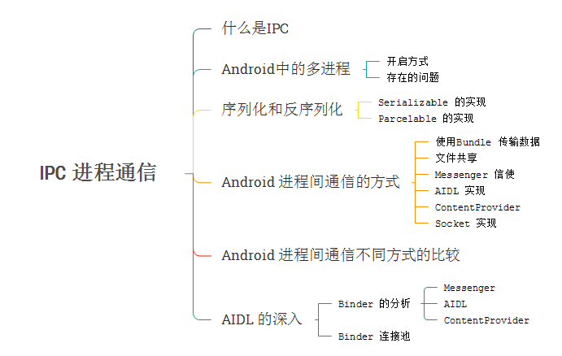
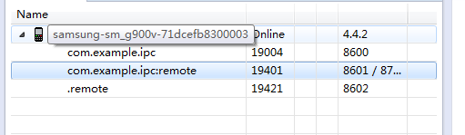
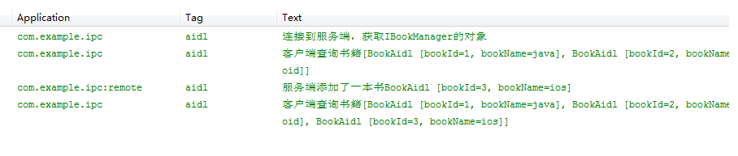

## Android 之 IPC 进程通信全解析


**本篇博客的框架**




### **什么是IPC**

IPC(Inter-Process Communication) 进程间通信，是指两个不同进程之间数据交换的过程。

在明确其之前，需要先搞懂几个概念:

- 线程：CPU可调度的最小单位，是程序执行流的最小单元；线程是进程中的一个实体，是被系统独立调度和分派的基本单位，线程自己不拥有系统资源，只拥有一点儿在运行中必不可少的资源，但它可与同属一个进程的其它线程共享进程所拥有的全部资源。
- 进程： 一个执行单元，在PC 和移动设备上一般指一个程序或者应用，一个进程可以包含多个线程。每一个进程都有它自己的地址空间，一般情况下，包括文本区域（text region）、数据区域（data region）和堆栈（stack region）。

在Android程序中，一般情况下一个程序就是一个进程（在无特别的代码实现下），UI线程即主线程。如果有耗时操作，则会导致主线程堵死。而在Android中主线程负责UI，和用户交互，如果堵死肯定影响用户的使用度。所以Android要求不能再主线程中有耗时操作，这时就要将耗时操作放在子线程中。


### **IPC 的使用场景**

- 程序因为自身原因，需要采用多进程模式来实现。
	- 有些模块由于特殊原因需要运行运行在单独的进程中。
	- 为了加大一个应用可使用的内存所以需要通过多进程来获取内存空间。
-  当前应用需要向其他应用获取数据。由于是两个应用，即两个进程。

> 在Android 中，每一个应用可使用的内存大小有限制，早起的一些版本在16M左右，不同的设备有不同的大小。可以通过多进程获取多份内存空间。

### **Android中的多进程**

#### **如何开启多进程**

Android中开启多进程只有一种方法，便是给四大组件（`Activity`，`Receiver`，`ContentProvider`，`Service`）指定`android
:process`属性，初次之外没有其他方法。请注意，不能指定某一个线程或者实体类指定其所运行的进程

> 通过jni调用底层去开启多进程也是一种方法，但属于特殊情况，不进行考虑；


首先编写三个`Activity`，并在清单文件中做如下注册：

```xml
 <activity
            android:name=".MainActivity"
            android:label="@string/app_name" >
            <intent-filter>
                <action android:name="android.intent.action.MAIN" />

                <category android:name="android.intent.category.LAUNCHER" />
            </intent-filter>
        </activity>
        <activity
            android:name="com.example.ipc.SecondActivity"
            android:process=":remote" />
        
        <activity
            android:name="com.example.ipc.ThirdActivity"
            android:process=".remote" />
 ```

对`MainActivity`不进行指定，则默认为当前进程。

对`SecondActivity`指定属性`android:process=":remote"`。

对`ThirdActivity`指定属性`android:process=".remote"`。

注意`SencodActivity`和`ThirdActivity`的进程参数不同。


把三个页面都打开，通过DDMS可以看到三个进程的开启




启动了三个进程：分别是

- `com.example.ipc`：默认的程序进程。和包名相同。
- `com.example.ipc:remote`：`SecondActivity`所在的进程。
- `.remote`：`ThirdActivity`所在的进程。


那么2和3 ，进程名不同有什么区别吗；

- 如果进程名以：开始，表示是要在当前的进程名前附加上当前的包名，表示该进程是本应用的私有进程，其他应用不可以和其跑在同一个进程。
- 如果进程名不以:开始，表示不需附加包名信息，是一个完全的命名。同时该进程是全局进程，其他应用可以通过`ShareUID`和其跑在同一个进程中。


#### **开启多进程存在的问题**

通过如上方式，很简单的变开启了多进程，但是，如果仅仅这样的话，会有大问题。

看下面一个例子：

添加一个公有的类，添加静态字段：

```java  
/**
 * 类似平常开发中的工具类等
 * @author MH
 *
 */
public class PublicContant {

	public static int m = 1;
	
}

```

在`MainActivity`中Log一下并修改字段

```java 

	@Override
	protected void onCreate(Bundle savedInstanceState) {
		super.onCreate(savedInstanceState);
		setContentView(R.layout.activity_main);
		
		
		Log.i("info", PublicContant.m+"");
		
		PublicContant.m++;
	}

```

在`SecondActivity`中Log一下：

```java 
	@Override
	protected void onCreate(Bundle savedInstanceState) {
		super.onCreate(savedInstanceState);
		setContentView(R.layout.activity_second);
		
		Log.i("info", PublicContant.m+"");		
	}
	

```


根据上面的逻辑，Log信息应该是1，和2 。但是呢，不是这样的。


两个都是1，我靠。。先不问原因，看结果就知道是错的。多进程这么不靠谱，肿么回事??


Android 为每一个进程都分配一个独立的虚拟机，不同的虚拟机在内存分配上有不同的地址空间，这就导致在不同虚拟机中访问同一个类对象会产生多个副本。

对于当前来说，进程`com.example.ipc`和`com.example.ipc:remote`都存在一个`PublicContant`类，并且这两个类是相互不干扰的，一个进程中修改了该值的对象，对其他进程中的该值不会造成任何影响。

> 运行在同一个进程中的组件是属于同一个虚拟机和同一个`Application`的。同理，运行在不同进程中的组件是属于两个不同的虚拟机和`Application`的。


根据如上所述，多进程所造成的问题分为如下几个方面：

- 静态成员和单例模式完全失效
	- 如上分析，创建了不同的内存，多个对象，当然单例什么的都无效了。
- 线程同步机制完全失效
	- 不是一块内存区域，线程锁当然无效了。
- `SharedPreference`的可靠性下降
	- `sharedPreference`的底层实现是通过读写XML文件，两个进程去读写，并发显然是可能出现问题的。
- `Application`会多次创建
	


### **序列化和反序列化**

在了解多进程通信之前，我们需要了解两个基础的概念，序列化和反序列化。

- 序列化：将对象转化为可保存的字节序列。（注意，是对象）。
- 反序列：将字节序列恢复为对象的过程。

序列化和反序列的用途：

- 以某种存储形式使自定义对象序列化。
- 将对象从一个地方传递到另一个地方。
- 通过序列化在进程间传递对象。


在`Android`中实现序列化的方式有两种，`Serializable`和`Parcelable`。


#### **Serializable**

`Serializable`是Java提供的一个序列化接口，他是一个空接口，是类实现该接口即可实现序列化。

```java 
/**
 * Serializable 序列化对象
 * @author MH
 *
 */
public class Book implements Serializable {
	/**
	 *  序列化和反序列的关键
	 */
	private static final long serialVersionUID = 1L;

	
	public int bookId;
	
	public String bookName;

}

```

在实现`Serializable`时候，编译器会提示，让我们添加`serialVersionUID`字段，该字段是一个关键的字段，后面会说。

相应的实现好了，那么如何写入和读取呢？

- 写入
 
```java
	public void writeSerializable() {
		try {
			// 构造对象
			Book book = new Book();
			// 构造序列化输出字节流
			ObjectOutputStream oos = new ObjectOutputStream(new FileOutputStream("xxx.txt"));
			// 序列化对象
			oos.writeObject(book);
			// 关闭流
			oos.close();
		} catch (Exception e) {
			e.printStackTrace();
		}
	}

 ```

- 读取

```java 
	public void readSerializable() {
		try {
			// 创建序列化读取字节流
			ObjectInputStream ois = new ObjectInputStream(new FileInputStream(
					"xxx.txt"));
			// 反序列化（读取）对象
			Book book = (Book) ois.readObject();
			// 关闭流
			ois.close();
		} catch (Exception e) {
			e.printStackTrace();
		}
	}

```

在序列化时，如果我们序列化对象之后，改变了我们的类结构（添加或改变字段），甚至是修改了字段的类型，修改了类名，那么我们能反序列化成功吗。

那么关键就在于`serialVersionUID`字段。

如果我们不指定的话。在序列化时，会计算当前类结构的hash值并将该值赋给`serialVersionUID`，当反序列时，会比对该值是否相同，如果不相同，则无法序列化成功。

我们也可以手动指定，手动指定的好处是在类结构发生变化时，能够最大程度的反序列，当然前提是只是删除或添加了字段，如果是变量类型发生了变化，则依然无法反序列成功。

> serialVersionUID 的工作机制：序列化时系统会把当前类的`serialVersionUID`写入序列化文件中，当反序列化时候系统会去检测文件中的`serialVersionUID`,看它是否和当前类的`serialVersionUID`一致，如果一致说明序列化类的版本和当前类的版本是相同的，这个时候可以成功反序列化，否则就说明当前类和序列化的类相比发生了某些变化。所以，我们最好指定`serialVersionUID`，避免他自定生成。


#### **Parcelable**

`Parcelable`是Android中特有的一种序列化方式，在`intent`传值时，通常使用该方式。

该方式实现序列化，依然实现`Parcelable`，然后实现一些该接口的方法。

```java
/**
 * Parcelable 对象的使用方式
 * @author MH
 *
 */
public class Book implements Parcelable {
	
	public int bookId;
	
	public String bookName;

	@Override
	public int describeContents() {
		// 返回当前对象的内容描述。几乎所有情况下都是返回0
		return 0;
	}

	@Override
	public void writeToParcel(Parcel dest, int flags) {
		// 将当前对象写入到序列化结构中		
		dest.writeInt(bookId);
		dest.writeString(bookName);
	}
	
	
	public static final Parcelable.Creator<Book> CREATOR = new Parcelable.Creator<Book>() {

		@Override
		public Book createFromParcel(Parcel source) {
			//从序列化后的对象中创建原始的值
			Book book = new Book();
			book.bookId = source.readInt();
			book.bookName = source.readString();
			
			return book;
		}

		@Override
		public Book[] newArray(int size) {
			//创建指定长度的原始对象数组
			return new Book[size];
		}
	};
	

}
```

`Parcelable`实现两个方法，创建一个字段：

- 实现`describeContents()`：返回当前对象的内容描述。几乎所有情况下都是返回0。
- 实现`public void writeToParcel(Parcel dest, int flags)`：// 将当前对象写入到序列化结构中
- 构造`Parcelable.Creator`字段，该对象需要实现两个方法：
	- `public Book createFromParcel(Parcel source)`：从序列化后的对象中创建原始的值。
	- `public Book[] newArray(int size)`：创建指定长度的原始对象数组


#### **Serializable和Parcelable的比较**

- `Serializable`是Java中的序列化接口，其使用起来简单但是开销较大，序列化和反序列化需要大量的I/O操作。
- `Parcelable`是Android中的序列化方式，更适用于Android的平台上，他的缺点是使用起来稍微麻烦，但是效率很高。
- `Parcelable`适合进程间的通信，运行期。`Serializable`适合文件存储即网络传输。


### **Android 进程间通信的方式**

#### **使用Bundle 传输数据**

Android中的四大组件中，其中有三大组件（`Activity`,`Service`,`Receiver`）都支持`Intent`中传递`Bundle`数据，如果看其源码，会发现其也是实现了`Parcelable`接口，所以其能够在不同进程中传输。

当然在传输的过程中，其所传输的数据必须支持序列化。比如基本数据类型，字符串，`Parcelable`的实现类，`Serializable`的实现类。由于该方法非常常用，不在多说。


#### **文件共享**

文件共享： 将对象序列化之后保存到文件中，在通过反序列，将对象从文件中读取。


在`MainActvity`中写写入对象
```java 

	/**
	 * 写入序列化对象
	 */
	public void wirte() {
		Book book = new Book();
		book.bookId = 1;
		book.bookName = "si";
		try {
			
			// 构造序列化输出字节流
			ObjectOutputStream oos = new ObjectOutputStream(
					new FileOutputStream(PATH));
			// 序列化对象
			oos.writeObject(book);
			// 关闭流
			oos.close();
		} catch (Exception e) {
			e.printStackTrace();
		}

		System.out.println(book);

	}

```

在`SecondActivity`中，读取文件（反序列化）

```java 

public void read() {
		Book book = null;
		try {
			// 创建序列化读取字节流
			ObjectInputStream ois = new ObjectInputStream(new FileInputStream(
					MainActivity.PATH));
			// 反序列化（读取）对象
			book = (Book) ois.readObject();
			// 关闭流
			ois.close();
		} catch (Exception e) {
			e.printStackTrace();
		}

		System.out.println(book);
	}
```

LOG 结果

```java 
06-28 09:20:47.916: com.example.ipc(进程名) I/System.out(12399): Book [bookId=1, bookName=si]
06-28 09:20:53.376: com.example.ipc:remote（进程名） I/System.out(12866): Book [bookId=1, bookName=si]


```


分属不同的进程成功的获取到了共享的数据。


通过共享文件这种方式来共享数据对文件的格式是没有具体的要求的。比如可以是文件，也可以是Xml,JSON 等。只要读写双方约定一定的格式即可。

同文件共享方式也存在着很大的局限性。即并发读/ 写的问题。读/写会造成数据不是最新。同写很明显会出现错误。

文件共享适合在对数据同步要求不高的进程之间进行通信。并且要妥善处理并发读写的问题。

> SharedPreference 底层文件的方式。不适合在多进程中共享数据。


#### **Messenger**

`Messenger` 可以翻译为信使，通过该对象，可以在不同的进程中传递`Message`对象。注意，两个单词不同。

下面就通过服务端（Service）和客户端(Activity)的方式进行演示。


客户端向服务端发送消息，可分为以下几步。

服务端

- 创建`Service`
- 构造`Handler`对象，实现`handlerMessage`方法。
- 通过`Handler`对象构造`Messenger`信使对象。
- 通过`Service`的`onBind()`返回信使中的`Binder`对象。


客户端

- 创建`Actvity`
- 绑定服务
- 创建`ServiceConnection`,监听绑定服务的回调。
- 通过`onServiceConnected()`方法的参数，构造客户端`Messenger`对象
- 通过`Messenger`向服务端发送消息。


实现服务端

```java 

/**
 *  Messenger 的使用  服务端
 * @author MH
 *
 */
public class MessengerService extends Service {

	/**
	 * 构建handler 对象
	 */
	public static Handler handler = new Handler(){
		public void handleMessage(android.os.Message msg) {
			// 接受客户端发送的消息
			
			String msgClient = msg.getData().getString("msg");
			
			Log.i("messenger","接收到客户端的消息--"+msgClient);
			
		};
	};
	
	
	// 通过handler 构建Mesenger 对象
	private final Messenger messenger = new Messenger(handler);
	
	@Override
	public IBinder onBind(Intent intent) {
		// 返回binder 对象
		return messenger.getBinder();
	}
}
```

> 注册服务别忘了 ，同时对服务修改其进程。

实现客户端


```java 
/**
 * Messenger 的使用 客户端
 * 
 * @author MH
 * 
 */
public class MessengerActivity extends AppCompatActivity {

	/**
	 * Messenger 对象
	 */
	private Messenger mService;

	private ServiceConnection conn = new ServiceConnection() {

		@Override
		public void onServiceConnected(ComponentName name, IBinder service) {
			// IBinder 对象
			// 通过服务端返回的Binder 对象 构造Messenger 
			mService = new Messenger(service);

			Log.i("messenger", "客户端以获取服务端Messenger对象");
		}

		@Override
		public void onServiceDisconnected(ComponentName name) {

		}

	};

	@Override
	protected void onCreate(@Nullable Bundle savedInstanceState) {
		super.onCreate(savedInstanceState);
		setContentView(R.layout.activity_messenger);

		// 启动服务
		Intent intent = new Intent(this, MessengerService.class);
		bindService(intent, conn, BIND_AUTO_CREATE);
	}

	/**
	 *  布局文件中添加了一个按钮，点击该按钮的处理方法
	 * @param view
	 */
	public void send(View view) {
		try {
			// 向服务端发送消息
			Message message = Message.obtain();

			Bundle data = new Bundle();

			data.putString("msg", "lalala");

			message.setData(data);
			// 发送消息
			mService.send(message);
			
			Log.i("messenger","向服务端发送了消息");
		} catch (Exception e) {
			e.printStackTrace();
		}
	}

}

```


看一下结果：


注释很清楚，不在多说，按照流程实现即可。 其中有一点需要注意：

我们是通过`Message`作为媒介去携带数据的。但是，`Message`的obj 并没有实现序列化（实现`Serializable`或`Parcelable`）,也就是其不能保存数据。必须使用`message.setData()`方法去传入一个`Bundle`对象，`Bundle`中保存需要传入的数据。


传递时使用的是`Messenger.send(Message)`方法。


服务端向客户端发送了消息，那么服务端向客户端发送消息也类似：

关键点： 客户端向服务端发送消息是，通过`msg.replyTo`将客户端`Messenger`对象传给服务端。


客户端代码进行修改：

- 创建客户端`Handler`和`Messenger`对象。
- 修改`send()`方法。

```java 

/**
	 * 构建handler 对象
	 */
	public static Handler handler = new Handler(){
		public void handleMessage(android.os.Message msg) {
			// 接受服务端发送的消息
			
			String msgService = msg.getData().getString("msg");
			
			Log.i("messenger","接收到服务端的消息--"+msgService);
			
		};
	};
	
	
	// 通过handler 构建Mesenger 对象
	private final Messenger messengerClient = new Messenger(handler);
	
	
	/**
	 *  布局文件中添加了一个按钮，点击该按钮的处理方法
	 * @param view
	 */
	public void send(View view) {
		try {
			// 向服务端发送消息
			Message message = Message.obtain();

			Bundle data = new Bundle();

			data.putString("msg", "lalala");
		
			message.setData(data);
			
			// ----- 传入Messenger 对象
			message.replyTo = messengerClient;
			
			// 发送消息
			mService.send(message);
			
			Log.i("messenger","向服务端发送了消息");
		} catch (Exception e) {
			e.printStackTrace();
		}
	}


```


服务端代码修改


```java 
/**
	 * 构建handler 对象
	 */
	public static Handler handler = new Handler() {
		public void handleMessage(android.os.Message msg) {
			// 接受客户端发送的消息

			String msgClient = msg.getData().getString("msg");

			Log.i("messenger", "接收到客户端的消息--" + msgClient);

			// 获取客户端Messenger 对象

			Messenger messengetClient = msg.replyTo;

			// 向客户端发送消息
			Message message = Message.obtain();

			Bundle data = new Bundle();

			data.putString("msg", "ccccc");

			message.setData(data);

			try {
				// 发送消息
				messengetClient.send(message);
			} catch (RemoteException e) {
				// TODO Auto-generated catch block
				e.printStackTrace();
			}
		};
	};

```


结果不在演示了。


#### **AIDL**

AIDL是一种接口定义语言，用于约束两个进程间的通讯规则，供编译器生成代码，实现Android设备上的两个进程间通信(IPC)。

进程之间的通信信息，首先会被转换成AIDL协议消息，然后发送给对方，对方收到AIDL协议消息后再转换成相应的对象。

`AIDL`的关键便是`Binder`,关于`Binder`，后面的博客会分析。在这里之将如何使用它。

因为需要服务端和客户端共用`aidl`文件，所以最好单独建一个包，适合拷贝到客户端。


服务端：

- 添加如下包名：`com.example.ipc.aidl`
- 创建`BookAidl.java`,该对象需要作为传输。所以需要实现`Parcelable`。


```java 
public class BookAidl implements Parcelable {

	public int bookId;

	public String bookName;

	public BookAidl() {
		super();
		
	}
	
	public BookAidl(int bookId, String bookName) {
		super();
		this.bookId = bookId;
		this.bookName = bookName;
	}

	@Override
	public int describeContents() {
		return 0;
	}

	@Override
	public void writeToParcel(Parcel dest, int flags) {
		dest.writeInt(bookId);
		dest.writeString(bookName);
	}

	public static final Parcelable.Creator<BookAidl> CREATOR = new Creator<BookAidl>() {

		@Override
		public BookAidl[] newArray(int size) {
			return new BookAidl[size];
		}

		@Override
		public BookAidl createFromParcel(Parcel source) {

			BookAidl book = new BookAidl();
			book.bookId = source.readInt();
			book.bookName = source.readString();
			return book;
		}
	};

	@Override
	public String toString() {
		return "BookAidl [bookId=" + bookId + ", bookName=" + bookName + "]";
	}

}

```

`Parcelable`在前面已经说过，不在多说。


- 创建`.aidl`文件。因为需要用到`BookAidl`对象，所以需要先声明。

创建`BookAidl.aidl`文件，并手动添加

```java 
package com.example.ipc.aidl;

parcelable BookAidl;

```

创建`IBookManager.aidl`文件，接口文件，面向客户端调用

```java 
package com.example.ipc.aidl;

import com.example.ipc.aidl.BookAidl;

interface IBookManager{
	List<BookAidl> getBookList();
	void addBook(in BookAidl book);
}

```

写完之后`clean`一下工程，之后会在`gen`目录下生成对应的java文件。此java中的具体含义后面会解释，在此不做多述。


- 继续编写服务端，创建`Service`类。

```java 
public class BookService extends Service {

	/**
	 * 支持线程同步，因为其存在多个客户端同时连接的情况
	 */
	private CopyOnWriteArrayList<BookAidl> list = new CopyOnWriteArrayList<>();

	
	/**
	 * 构造 aidl中声明的接口的Stub对象，并实现所声明的方法
	 */
	private Binder mBinder = new IBookManager.Stub() {

		@Override
		public List<BookAidl> getBookList() throws RemoteException {
			return list;
		}

		@Override
		public void addBook(BookAidl book) throws RemoteException {
			list.add(book);
			Log.i("aidl", "服务端添加了一本书"+book.toString());
		}
	};
	
	@Override
	public void onCreate() {
		super.onCreate();
		//加点书
		list.add(new BookAidl(1, "java"));
		list.add(new BookAidl(2, "android"));

	}

	@Override
	public IBinder onBind(Intent intent) {
		// 返回给客户端的Binder对象
		return mBinder;
	}
}

```

在`Service`中，主要干了两件事情：

- 实现aidl文件中的接口的Stub对象。并实现方法。
- 将`Binder`对象通过`onBinder`返回给客户端。


为了省事，在这里不在另起一个工程了，直接将`Service`在另一个进程中运行。

```xml 
<service
            android:name="com.example.ipc.BookService"
            android:process=":remote" />

```


**开始编写客户端**

因为在同一个工程中，不需要拷贝`aidl`包中的文件。如果不在同一个工程，需要拷贝。

```java 

public class BookActivity extends AppCompatActivity{
	
	/**
	 * 接口对象
	 */
	private IBookManager mService;
	
	/**
	 * 绑定服务的回调
	 */
	private ServiceConnection conn = new ServiceConnection(){

		@Override
		public void onServiceConnected(ComponentName name, IBinder service) {
			
			// 获取到书籍管理的对象
			mService = IBookManager.Stub.asInterface(service);
			
			Log.i("aidl", "连接到服务端，获取IBookManager的对象");
		}

		@Override
		public void onServiceDisconnected(ComponentName name) {
			
		}
		
	};
	
	@Override
	protected void onCreate(@Nullable Bundle savedInstanceState) {
		super.onCreate(savedInstanceState);
		
		setContentView(R.layout.activity_book);
	
		// 启动服务
		Intent intent = new Intent(this,BookService.class);
		bindService(intent, conn, BIND_AUTO_CREATE);
		
	}
	/**
	 * 获取服务端书籍列表
	 * @param view
	 */
	public void getBookList(View view){
		
		try {
			Log.i("aidl","客户端查询书籍"+mService.getBookList().toString());
		} catch (RemoteException e) {
			// TODO Auto-generated catch block
			e.printStackTrace();
		}
	}
	/**
	 * 添加书籍
	 */
	public void add(View view){
		
		try {
			// 调用服务端添加书籍
			mService.addBook(new BookAidl(3,"ios"));
		} catch (RemoteException e) {
			// TODO Auto-generated catch block
			e.printStackTrace();
		}
	}
}
```

客户端的代码和之前的`Messenger`很类似：

- 绑定服务，监听回调。
- 将回调中的`IBinder service`通过`IBookManager.Stub.asInterface（）`转化为借口对象。
- 调用借口对象的方法。

效果




总结来说可分为如下几步

服务端：

- 服务端创建.aidl文件和声明接口
- 创建类，继承Service，并实现onBind方法
- 在Service类中定义aidl中声明接口的Stub对象，并实现aidl接口中声明的方法
- 在onBind方法中返回Stub对象
- 在AndroidManifest.xml中注册Service并声明其Action

客户端

- 使用服务端提供的aidl文件
- 在Activity定义aidl接口对象
- 定义ServiceConnection对象，监听绑定服务的回调
- 回调中通过方法获取借口对象


#### **ContentProvider**

作为android 四大组件之一，虽然用的地方不是太多。但是其确实是多进程通信的一种方式。例如，获取通讯录信息，这明显跨应用了，肯定是多进程通信啊。


其底层实现和`Messenger`一样，都是通过`Binder`,后面会专门分析`Binder`对象。

`ContentProvider`很多介绍，在这不在多提。


#### **Socket实现**

`Socket`也称为“套接字”，是网络通信中的概念，它分为流式套接字和用户数据报套接字，分别对应于网络传输中的传输控制层的TCP和UDP。

该方面使用的是JAVA 方面的知识。该举例只是说明一个思路。不做细致的实现。

服务端

```java 
public class SocketService extends Service {

	/**
	 * 连接的状态
	 */
	private boolean isConnState = true;
	
	
	@Override
	public void onCreate() {
		super.onCreate();

		// 启动TCP 服务
		new Thread(new TCPServer()).start();
	}
	
	@Override
	public IBinder onBind(Intent intent) {
		return null;
	}
	
	
	@Override
	public void onDestroy() {
		// 结束TCP 服务
		isConnState = false;
		super.onDestroy();
	}
	
	/**
	 * 服务端TCP 服务，相当于服务器，接受Socket 连接
	 * @author MH
	 *
	 */
	class TCPServer implements Runnable{

		@Override
		public void run() {
			
			try {
				// 监听本地的12345 端口
				ServerSocket ss = new ServerSocket(12345);
				
				while(isConnState){
					
					// 获取客户端的Socket 对象
					Socket socket = ss.accept();
					
					// 获取输入流  --- 
					BufferedReader br = new BufferedReader(new InputStreamReader(socket.getInputStream()));
					// 通过输入流读取客户端的消息
					//String line = br.readLine();
					// 输出流
					BufferedWriter bw = new BufferedWriter(new OutputStreamWriter(socket.getOutputStream()));
					// 通过输出流向客户端发送消息
					//bw.write("....");
					
					// 关闭连接
					socket.close();
				}
				
				
			} catch (Exception e) {
				e.printStackTrace();
			}
		}
	}

}

```


服务启动时，在`onCreate`方法中启动了`TCPServer`，该线程时刻接受客户端的请求。


客户端

```java 
	public void conn(){
		try {
			// 指定ip和端口
			Socket s = new Socket("localhost", 12345);
			
			// ----- 和服务端类似
			BufferedReader br = new BufferedReader(new InputStreamReader(s.getInputStream()));
			//String line = br.readLine();
			// 输出流
			BufferedWriter bw = new BufferedWriter(new OutputStreamWriter(s.getOutputStream()));
			//bw.write("....");
			// 关闭连接
			s.close();
		} catch (Exception e) {
			e.printStackTrace();
		} 
	}

```

关于`Socket`，在此只是一个简单的示范，具体的使用博大精深。知道能实现即可。


### **Android 进程间通信不同方式的比较**


- `Bundle`:四大组件间的进程间通信方式，简单易用，但传输的数据类型受限。
-  文件共享： 不适合高并发场景，并且无法做到进程间的及时通信。
- `Messenger`: 数据通过`Message`传输，只能传输`Bundle`支持的类型
- `ContentProvider`：android 系统提供的。简单易用。但使用受限，只能根据特定规则访问数据。
- `AIDL`:功能强大，支持实时通信，但使用稍微复杂。
- `Socket`：网络数据交换的常用方式。不推荐使用。


### **TO DO**

#### **Binder 的细致分析**

在实现多进程通信时，其中`Messenger`,`ContentProvider`,`AIDL`的底层实现都是`Binder`，很有必要对其进行继续分析。


